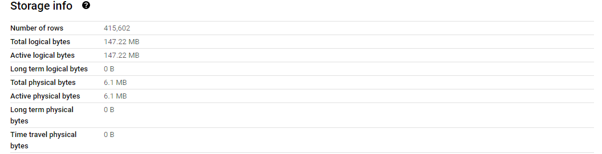
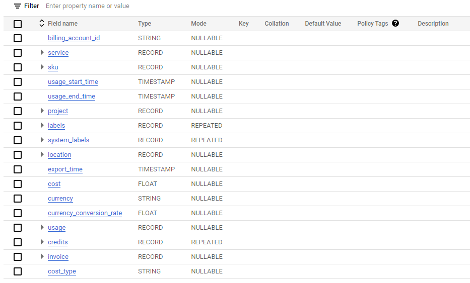
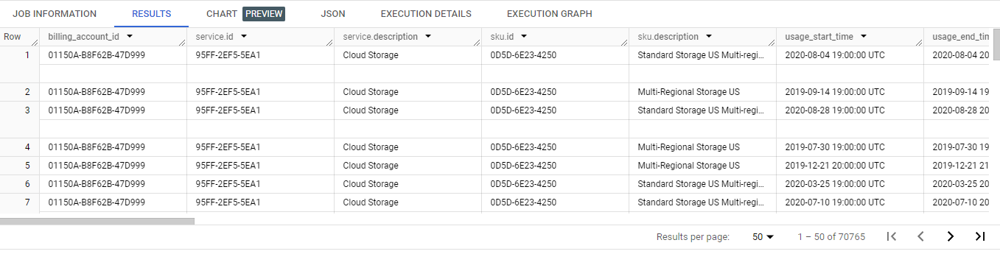
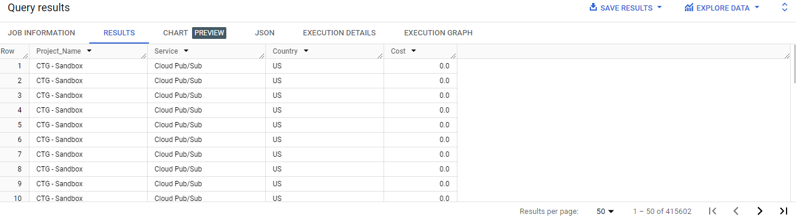
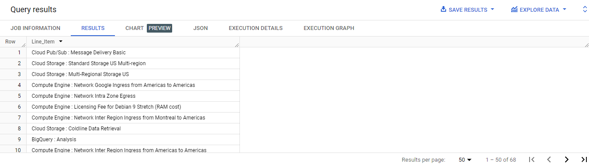
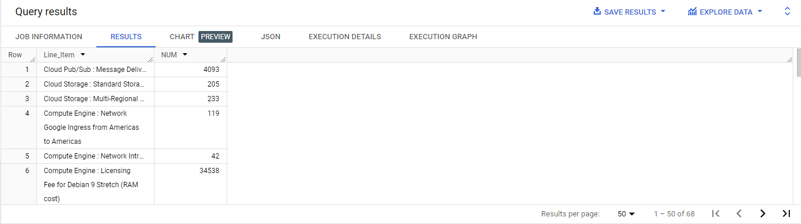
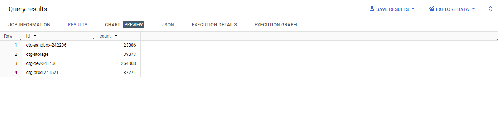
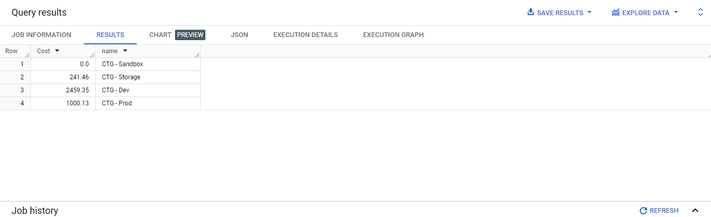

# Analyzing Billing Data with BigQuery

> 해당 글은 google skillsboost를 통해 실습한 내용을 정리하였습니다.

## ✏️ 개요

* BigQuery의 샘플 데이터셋과 테이블 조회

* 청구서 데이터에 간단한 쿼리 작성 및 실행

  

## ✏️ 실습

### 🦴작업 1.

> #### BigQuery에 데이터셋과 테이블 찾기

* Navigation menu -> BigQuery -> Explorer pane -> project ID -> Expand node -> billing_dataset 


### 🦴작업 2

> #### 청구 데이터 확인하기

* enterprise_biling -> SCHEMA : 테이블 필드 확인
* 415,602 rows





### 🦴작업 3

> #### SQL 쿼리를 사용하여 데이터 분석하기

* 전체 데이터 중 Cost가 발생한 경우만 조회하기

  * ```sql
    SELECT * FROM `billing_dataset.enterprise_billing` WHERE Cost > 0
    ```

  * 

* 특정 컬럼 값만 가져오기

  * ```sql
    SELECT
     project.name as Project_Name,
     service.description as Service,
     location.country as Country,
     cost as Cost
    FROM `billing_dataset.enterprise_billing`;
    ```

  * 

* 청구 주기에 사용된 고유 서비스를 확인하고 나열하기

  * ```sql
    SELECT CONCAT(service.description, ' : ',sku.description) as Line_Item 
    FROM `billing_dataset.enterprise_billing` 
    GROUP BY 1
    ```

  * 

* 서비스 사용량 분석하기

  * ```sql
    SELECT CONCAT(service.description, ' : ',sku.description) as Line_Item
    , Count(*) as NUM 
    FROM `billing_dataset.enterprise_billing` 
    GROUP BY CONCAT(service.description, ' : ',sku.description)
    ```

  * 

* 어떤 프로젝트가 가장 많은 기록을 보유했는지 확인

  * ```sql
    SELECT project.id
    	, count(*) as count 
    FROM `billing_dataset.enterprise_billing` 
    GROUP BY project.id
    ```

  * 

* 프로젝트 별 비용 계산하기

  * ```sql
    SELECT ROUND(SUM(cost),2) as Cost
    	, project.name 
    FROM `billing_dataset.enterprise_billing` 
    GROUP BY project.name
    ```

  * 