# BigQuery에서 JSON, 배열 및 구조체 작업

> 해당 글은 google skillsboost를 통해 실습한 내용을 정리하였습니다.

## ✏️ 개요

* BigQuery 내 반구조화된 데이터(JSON, 배열 데이터 유형 수집)를 다룬다
* 중첩 및 반복된 필드를 포함하는 단일 테이블로 스키마 비정규화
  * 성능 개선 가능
  * 배열 데이터 작업을 위한 SQL 구문이 복잡해질 수 있음
* 다양한 반 구조화된 데이터 세트의 로드, 쿼리, 문제 해결, 중첩 해제를 연습

## ✏️ 실습

### 🦴작업 1. 테이블을 저장할 새 데이터 세트 만들기

1. BigQuery 프로젝트에서 데이터 세트 만들기

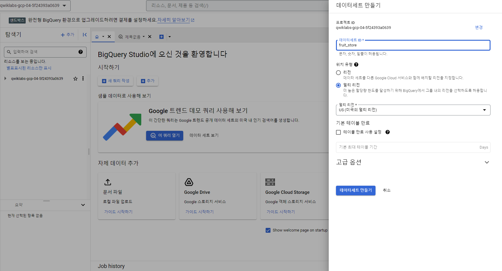

### 🦴작업 2. SQL에서 배열 다루기 연습


* 일반적으로 SQL에는 아래와 같이 각 행에 하나의 값만 존재

  | 행   | 과일       |
  | ---- | ---------- |
  | 1    | raspberry  |
  | 2    | blackberry |
  | 3    | strawberry |
  | 4    | cherry     |


* 이후 사람과 과일에 대한 데이터가 합쳐지면 다음과 같이 나타남

  | 행   | 과일       | 사람      |
  | ---- | ---------- | --------- |
  | 1    | raspberry  | sally     |
  | 2    | blackberry | sally     |
  | 3    | strawberry | sally     |
  | 4    | cherry     | sally     |
  | 5    | orange     | frederick |
  | 6    | apple      | frederick |

  위와 같이 데이터베이스에서 반복된 값이 나타날 경우  '과일'과 '사람' 으로 테이블을 분리해야겠다고 생각함 -> 이를 __정규화__라고 함

  하지만 데이터 웨어하우징의 경웬는 반대로(비정규화) 많은 개별 테이블을 하나의 대형 보고 테이블로 변환한다


> BigQuery는  기본적으로 배열을 지원

따라서 위와 같은 테이블이 아닌 하기와 같은 테이블 생성이 가능

| 행   | 과일(배열)                                  | 사람      |
| ---- | ------------------------------------------- | --------- |
| 1    | [raspberry, blackberry, strawberry, cherry] | sally     |
| 2    | [orange, apple]                             | frederick |

* BigQuery 쿼리 편집기를 통해 확인

```SQL
SELECT
['raspberry', 'blackberry', 'strawberry', 'cherry'] AS fruit_array
```

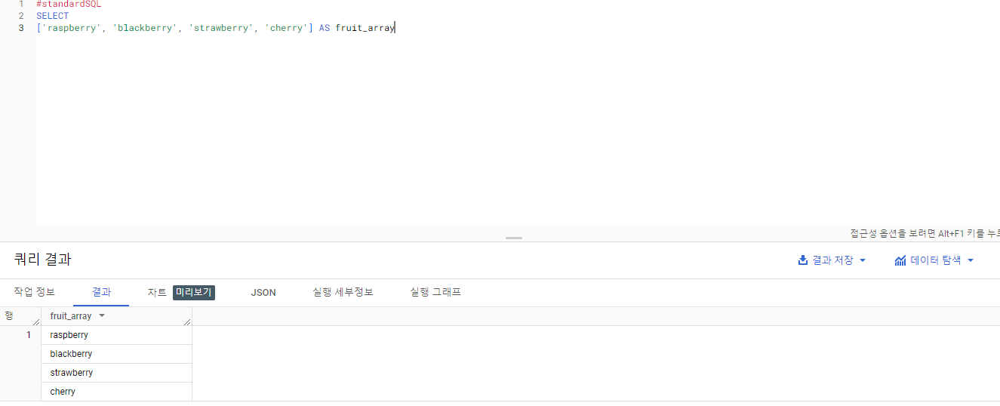

```sql
#standardSQL
SELECT person, fruit_array, total_cost FROM `data-to-insights.advanced.fruit_store`;
```

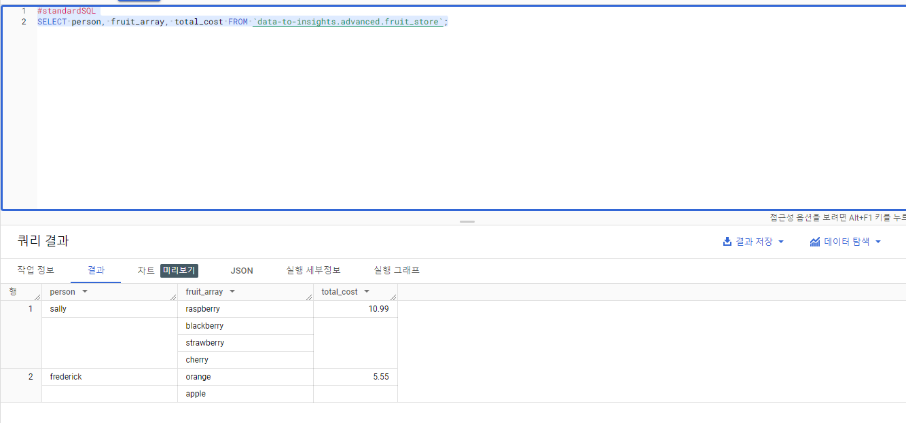


* 반구조화된 JSON을 BigQuery에 로드

  1. 위에서 생성한 fruit_store데이터 세트에 테이블 만들기

     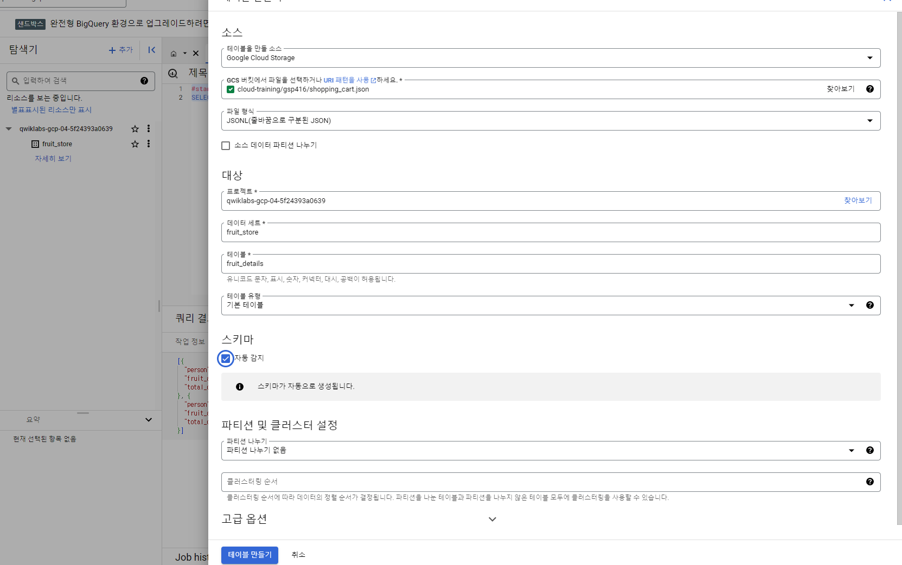

​			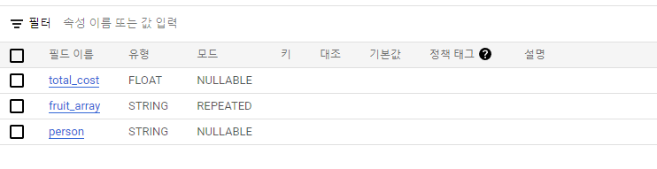

### 🦴작업 3. ARRAY_AGG()로 나만의 배열 만들

* ARRAY_AGG
* ARRAY_LENGTH


#### 오픈 데이터셋 확인

```sql
SELECT
  fullVisitorId,
  date,
  v2ProductName,
  pageTitle
  FROM `data-to-insights.ecommerce.all_sessions`
WHERE visitId = 1501570398
ORDER BY date
```

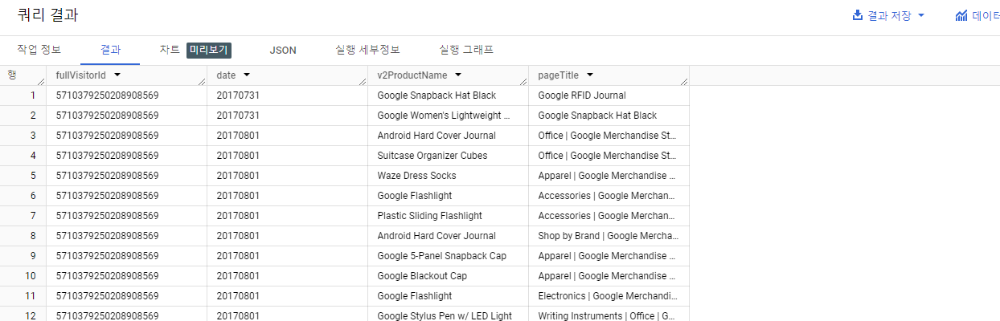


#### ARRAY_AGG()함수 사용하여 문자열을 배열로 집계

```sql
SELECT
  fullVisitorId,
  date,
  ARRAY_AGG(v2ProductName) AS products_viewed,
  ARRAY_AGG(pageTitle) AS pages_viewed
  FROM `data-to-insights.ecommerce.all_sessions`
WHERE visitId = 1501570398
GROUP BY fullVisitorId, date
ORDER BY date
```

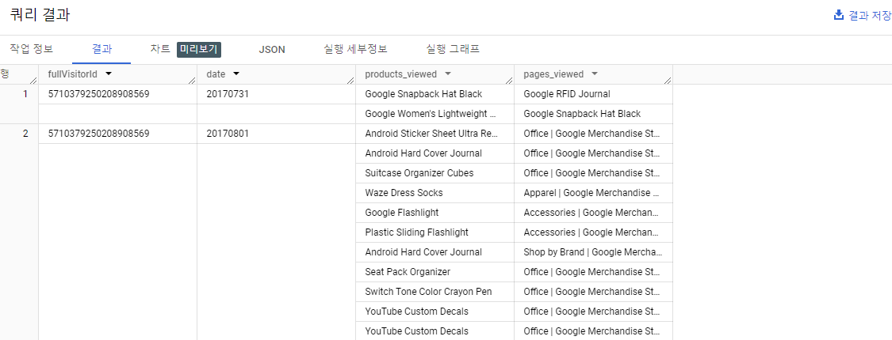

#### ARRAY_LENGTH()를 사용하여 조회된 페이지 및 제품 수 확인

```sql
SELECT
  fullVisitorId,
  date,
  ARRAY_AGG(v2ProductName) AS products_viewed,
  ARRAY_LENGTH(ARRAY_AGG(v2ProductName)) AS num_products_viewed,
  ARRAY_AGG(pageTitle) AS pages_viewed,
  ARRAY_LENGTH(ARRAY_AGG(pageTitle)) AS num_pages_viewed
  FROM `data-to-insights.ecommerce.all_sessions`
WHERE visitId = 1501570398
GROUP BY fullVisitorId, date
ORDER BY date
```


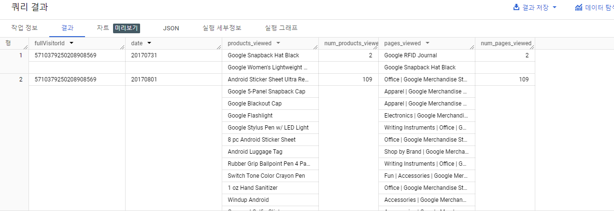

#### DISTINCT추가하여 고유한 수 확인

```sql
SELECT
  fullVisitorId,
  date,
  ARRAY_AGG(DISTINCT v2ProductName) AS products_viewed,
  ARRAY_LENGTH(ARRAY_AGG(DISTINCT v2ProductName)) AS distinct_products_viewed,
  ARRAY_AGG(DISTINCT pageTitle) AS pages_viewed,
  ARRAY_LENGTH(ARRAY_AGG(DISTINCT pageTitle)) AS distinct_pages_viewed
  FROM `data-to-insights.ecommerce.all_sessions`
WHERE visitId = 1501570398
GROUP BY fullVisitorId, date
ORDER BY date
```

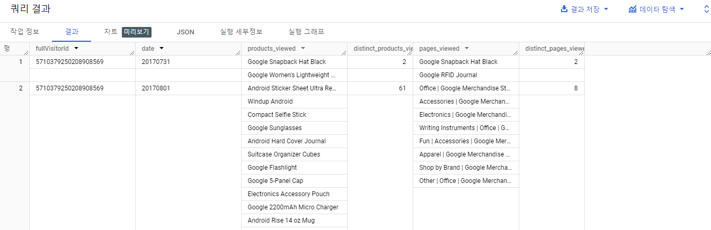

### 🦴작업 4. 배열이 있는 데이터 세트 쿼리

* UNNEST() 함수 사용
* 배열 요소를 다시 행으로 돌리려면 배열에 UNNEST() 함수를 수행

```sql
SELECT DISTINCT
  visitId,
  h.page.pageTitle
FROM `bigquery-public-data.google_analytics_sample.ga_sessions_20170801`,
UNNEST(hits) AS h
WHERE visitId = 1501570398
LIMIT 10
```


### 🦴작업 5. STRUCT 다루기

* STRUCT는 기본 테이블에 개별 테이블이 사전에 조인되어 있다고 생각하는 것이 쉬움
* 파이썬의 dict 또는 class의 속성을 떠올리면 편


1. STRUCT 포함한 테이블 생성

```sql
#standardSQL
SELECT STRUCT("Rudisha" as name, 23.4 as split) as runner
```

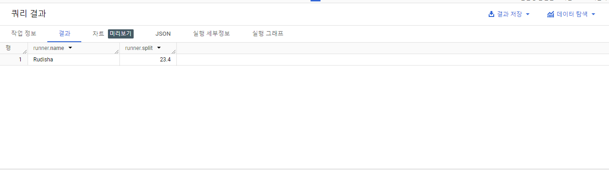

2. ARRAY IN STRUCT 포함한 테이블 생

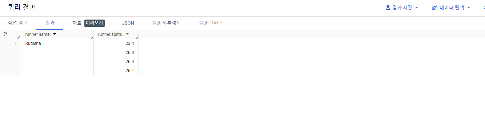	3. STRUCT 데이터 나열하기

```SQL
#standardSQL
SELECT race, participants.name
FROM racing.race_results
CROSS JOIN
participants  # this is the STRUCT (it is like a table within a table)
```

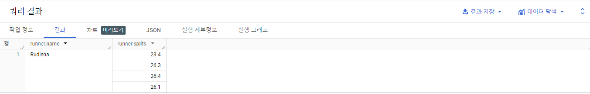

4. Query 단순화

```sql
#standardSQL
SELECT race, participants.name
FROM racing.race_results AS r, r.participants
```

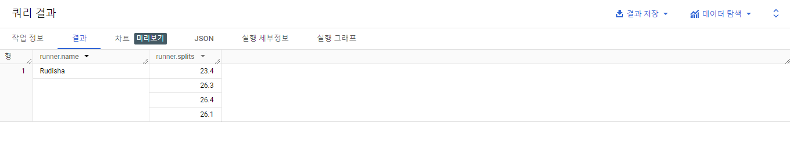